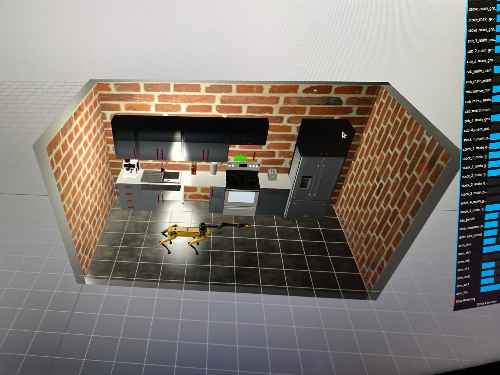

# Hi! I'm Shreya Chaudhary

```cpp
This website is currently under development!

Expect for some major changes to occur within the new few hours and days!
```

> **I am currently in the job market, seeking full-time positions in software engineering and algorithms engineering. If you think I could be a good fit, please [reach out](about.md#contact)!**

Welcome to my website! It's great to have you!

- Want a summary? Check out my [About Me](about.md)
- Check out the tabs for my experience in particular domains!
    - My biggest interest is MLSys or the intersection of [machine learning](ml.md) with [systems](perf.md)!

If you'd like to reach out about anything at all, feel free to email me at `genericp3rson [at] duck [dot] com`!

## Project Gallery

*Here are some fun photos of projects I've worked on! Hover over the image to get a brief description and click the image to learn more!*

<div class="carousel">
    <div class="carousel-inner">
        <div class="carousel-item">
            <a href="robotics">
                
                <div class="overlay">Modelling 1k+ Constellations in GMAT</div>
            </a>
        </div>
        <div class="carousel-item active">
            <a href="perf">
                
                <div class="overlay">Setup for RDMA-enabled File System</div>
            </a>
        </div>
        <div class="carousel-item">
            <a href="robotics">
                
                <div class="overlay">A robot to automatically assemble food orders</div>
            </a>
        </div>
        <div class="carousel-item">
            <a href="perf">
                
                <div class="overlay">Contributed to Finch, a Sparse Tensor Compiler</div>
            </a>
        </div>
        <div class="carousel-item">
            <a href="ml">
                
                <div class="overlay">Core Developer of TorchQuantum, a PyTorch framework for quantum machine learning!</div>
            </a>
        </div>
        <div class="carousel-item">
            <a href="projects">
                
                <div class="overlay">Gif of differential privacy algorithm run on synthetic energy data</div>
            </a>
        </div>
        <div class="carousel-item">
            <a href="robotics">
                
                <div class="overlay">High-resolution kitchen environment in Drake with Spot</div>
            </a>
        </div>
        <div class="carousel-item">
            <a href="projects">
                
                <div class="overlay">A sizeable tesla coil created in Radio Society</div>
            </a>
        </div>
        <div class="carousel-item">
            <a href="projects">
                
                <div class="overlay">A brushless motor created in advising!</div>
            </a>
        </div>
    </div>
    <button class="prev" onclick="moveSlide(-1)">&#10094;</button>
    <button class="next" onclick="moveSlide(1)">&#10095;</button>
</div>

<style>
    .carousel {
        position: relative;
        max-width: 1000px; /* Width of the carousel */
        overflow: hidden; /* Hide overflowing items */
        margin: auto; /* Center the carousel */
    }

    .carousel-inner {
        display: flex;
        transition: transform 0.5s ease; /* Smooth transition */
        width: 100%; /* Full width */
    }

    .carousel-item {
        min-width: 100%; /* Each item takes full width */
        position: relative; /* Positioning context for overlay */
        display: flex; /* Enable flexbox for centering */
        justify-content: center; /* Center content horizontally */
        align-items: center; /* Center content vertically */
        height: 300px; /* Fixed height for consistency */
        padding: 20px; /* Add some padding to the image */
        box-sizing: border-box; /* Include padding in total width and height */
    }

    .carousel-item img {
        width: auto; /* Allow width to scale */
        height: 100%; /* Use full height of the container */
        max-height: 100%; /* Ensure the image doesn't exceed the height */
        object-fit: contain; /* Ensure the entire image is visible */
    }

    .overlay {
        position: absolute;
        top: 0;
        left: 0;
        right: 0;
        bottom: 0;
        background-color: rgba(0, 0, 0, 0.7); /* Semi-transparent black */
        color: white;
        display: flex;
        justify-content: center; /* Center text horizontally */
        align-items: center; /* Center text vertically */
        opacity: 0;
        transition: opacity 0.3s; /* Smooth overlay appearance */
        padding: 20px; /* Padding around text */
        box-sizing: border-box; /* Include padding in total size */
    }

    .carousel-item:hover .overlay {
        opacity: 1; /* Show overlay on hover */
    }

    .prev, .next {
        cursor: pointer;
        position: absolute;
        top: 50%;
        transform: translateY(-50%);
        background-color: rgba(255, 255, 255, 0.7); /* Semi-transparent white */
        border: none;
        padding: 10px;
        font-size: 18px;
        border-radius: 5px;
        z-index: 10; /* Ensure buttons are above other content */
    }

    .prev {
        left: 10px; /* Position on the left */
    }

    .next {
        right: 10px; /* Position on the right */
    }
</style>


<script>
    let currentSlide = 0;
    const slideInterval = 3000; // Change to desired interval in milliseconds
    let intervalId;

    function moveSlide(direction) {
        const items = document.querySelectorAll('.carousel-item');
        currentSlide += direction;

        if (currentSlide < 0) {
            currentSlide = items.length - 1; // Wrap around to the last slide
        } else if (currentSlide >= items.length) {
            currentSlide = 0; // Wrap around to the first slide
        }

        const newTransform = -currentSlide * 100; // Calculate the new transform value
        document.querySelector('.carousel-inner').style.transform = `translateX(${newTransform}%)`;
    }

    // Automatically move to the next slide every slideInterval milliseconds
    function startAutoSlide() {
        intervalId = setInterval(() => {
            moveSlide(1); // Move to next slide
        }, slideInterval);
    }

    // Event listener to reset the timer
    document.querySelector('.carousel-inner').addEventListener('click', () => {
        clearInterval(intervalId); // Clear existing interval
        startAutoSlide(); // Restart automatic sliding
    });

    startAutoSlide(); // Start automatic sliding when the script loads
</script>

