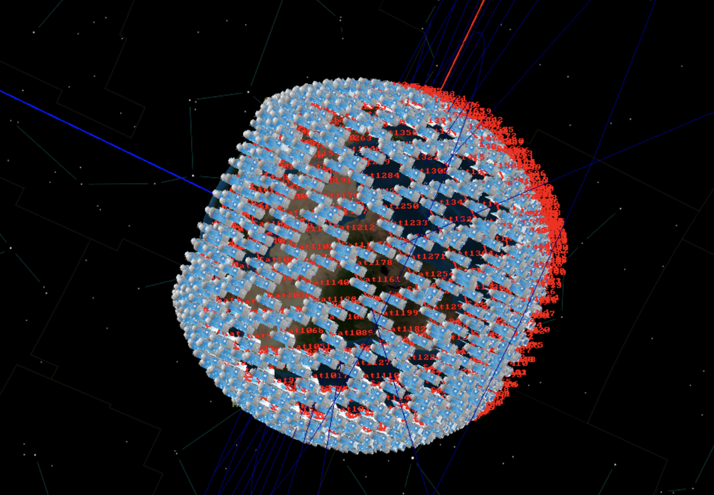
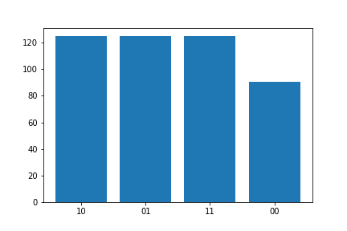
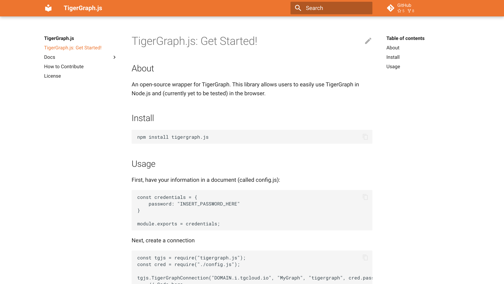
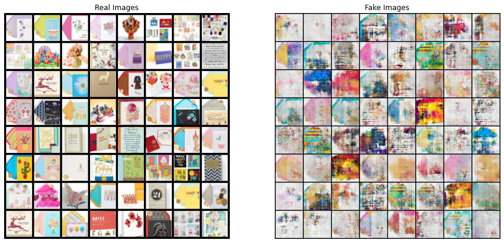

# Projects (and Skills)

There are a ton of things I'm interested in and I'm still exploring! Unfortunately, I can't open-source a lot of the work I'm doing right now, but here are some open-source or completed projects I've worked on!

## General Projects

???+ note "Personal Technical Blog"
    [https://shreya-chaudhary.medium.com/](https://shreya-chaudhary.medium.com/)
    
    I used to write blogs on concepts and projects I was working on, publishing with top data science publications like Towards Data Science, Geek Culture, DataDrivenInvestors, Dev Genius, and more! I even had a publication reach out to translate my article! Check it out to see a ton of my older projects! You'll notably find a ton of TigerGraph projects I worked on! Here are some pictures from those projects!

    

## Technical Projects

???+ note "Modelling 1000+ Satellites with GMAT"
    Over the summer, I got to learn how to conduct orbit modelling and wrote a Python program to generate a script to feed into NASA's GMAT to simulate over 1,000 satellites in low-Earth orbit (LEO). This is simulating a Walker Constellation.
    
    

???+ note "A Suite of Differential Privacy Algorithms"
    During IAP 2023, I helped develop a suite of differential privacy algorithms specifically for energy-related use cases. I used the Laplace Mechanism to add sufficient noise to both continuous and discrete data. Here's a gif of the algorithm in action, generating a synthetic dataset on some arbitrary distribution I created. You'll notice that at the beginning, the data is completely different from the original dataset; however, over time, it converges to roughly the ideal dataset with a certain amount of noise.

    

### Libraries

???+ note "TorchQuantum"
    I've helped out with expanding and maintaining [TorchQuantum](https://github.com/mit-han-lab/torchquantum), a GPU-accelerated PyTorch-based framework for quantum computing and simulation. I've worked on streamlining the review process for new PRs, solidifying the structure of the framework, and added several new gates. I also penned a [new tutorial](https://github.com/mit-han-lab/torchquantum/tree/main/examples/qubit_rotation).

    

???+ note "TigerGraph.js"
    I developed a Node.js connector to ease the process for full-stack developers to use TigerGraph. (This project also managed to win 3rd place overall at the Graphathon challenge!) 

    

## Fun Generative Projects

???+ note "A DCGAN Birthday Card"
    For a friend's birthday, I used Selenium to scrape a ton of birthday card images and trained a [Deep Convolutional Generative Adversial Network](https://www.tensorflow.org/tutorials/generative/dcgan) to make a birthday card. The results weren't bad given the noise—check it out! (The input images are on the left and the generated images are on the right.)

    
 
???+ note "Using Quantum Procedural Generation on Squirrels"
    For our final project for introduction to quantum computing over IAP, my project partners and I used quantum procedural generation on squirrels. Check out this [blog](https://medium.com/mit-6-s089-intro-to-quantum-computing/quantum-image-manipulation-2c8e7ea6a64e) outlining what we did!

    

